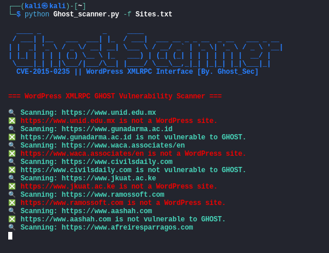

### 😈 WordPress XMLRPC GHOST Vulnerability Scanner 😈

## 📜 Description

This Python script scans for the **CVE-2015-0235** vulnerability in **WordPress** sites. The vulnerability is due to improper handling of XML-RPC requests in WordPress, allowing attackers to exploit the system without authentication.

### 🔥 Vulnerable Versions:
- **WordPress 4.2.4** and earlier

### 🛡️ Patched Versions:
- **WordPress 4.2.5** and later

⚠️ **Disclaimer**: Use this tool responsibly and only with explicit permission from the target environment's owner.

## 🚀 Features

- 🔍 **Scan**: Check single or multiple WordPress URLs for vulnerability.
- 💾 **Output Results**: Save scan results to a specified output file.

### ⌛ Queries
- FOFA = `title="WordPress" && body="xmlrpc.php" && header="HTTP/1.1 200 OK"`
- ZoomEye = `title:"WordPress" port:80 "xmlrpc.php"`
- Shodan = `"xmlrpc.php" "WordPress" port:80,443`

## 🛠️ Usage
- Single target
```bash
python Ghost_scanner.py -u http://testphp.vulnweb.com/
```
- Multiple target
```bash
python Ghost_scanner.py -f {{file.txt}}
```
<p align="center">

</p>
